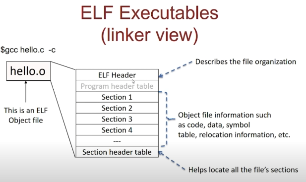
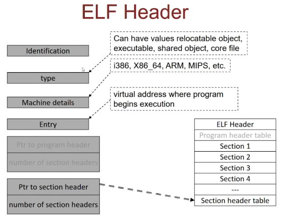
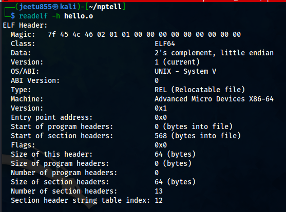
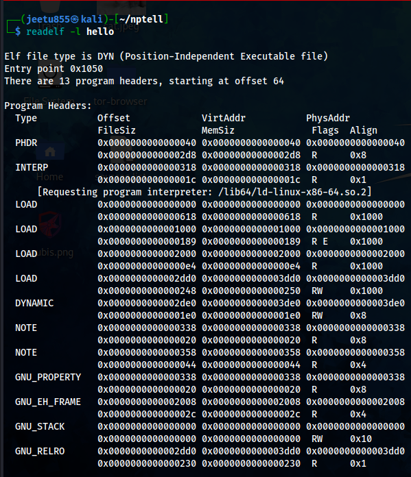
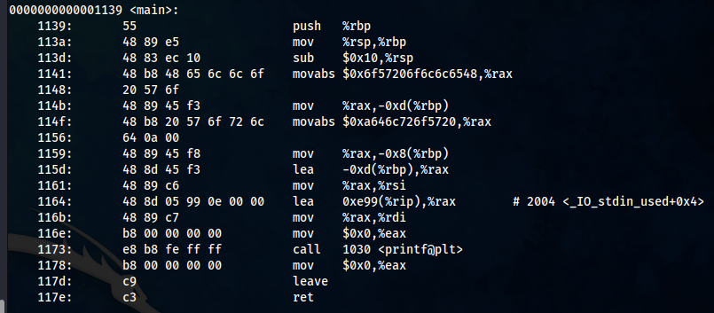
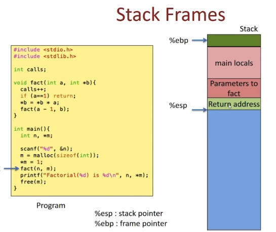
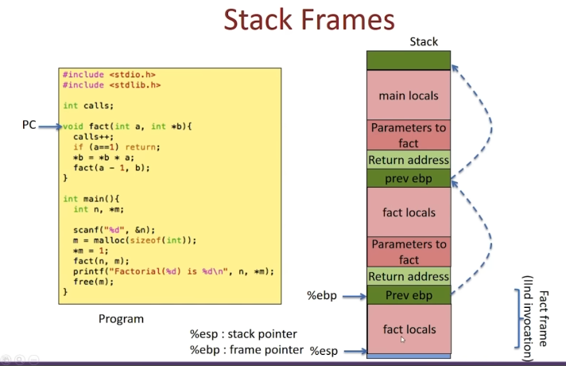

Flaws is system : 1) Design Flaw 2) Hardware Flaws, maybe introduced during manufacturing of system  
 3) Human Factor 4) Bugs in a program

---

### Program Binaries

Write a program, example hello.c
Compile it: gcc hello.c -o hello Compiler binary format in Linux :ELF(Executable and Linkable Format)
When we run it using ./hello, a process is created in RAM

ELF format describes a structue by which object files and executables need to be stored
There are 2 views for ELF 1) Linker View : for object files 2) Executable view : for executables

#### Linker View

To create an object file for a C program run
gcc hello.c -c : this create hello.o, now hello.o is an elf object file

Structure of object file



1. ELF Header : Describes the file organization
2. Various sections that contain code, data, relocation table etc
3. Section Header Table : Helps us locate various sections present in the elf object file

##### ELF Header



1. Identifier : Contains magic number to identify the type of file
2. Type : can have values relocatable object, executable, shared object, core file
3. Machine Details : which processor the particular file was compiled for : 386, x86_64, ARM, MIPS etc
4. Entry : Virtual address where program has to begin execution
5. Pointer to section header table
6. Number of section headers

To read elf header

```sh
gcc hello.c -c
readelf -h hello.o
```



Start of section Headers : offset of 568 bytes into the file
Number of section headers = 13

To reader section header table

```sh
readelf -S hello.o
```


Addr column : virtual address of various sections, each of these sections are relocatable since it is an object file so address present here are all 0
Offset : the offset within the ELF object

#### Executable View

To generate an ELF executable

```sh
gcc hello.c -o hello
```

hello executable has a format like the following


Very similar to linker view
Sections are now called segments
Program Header table applicable while in linker format even though it was present it was not used, helps to locate various file segments
Here on the other hand, the `Section Header Table` is not used
ELF header as same structure

Program Header Table : Contains various program headers for various segments
**One header corresponding to each segment**
Contents of program header

- type : type of segment (loadable segment/shared library etc)
- offset : offset of segment in ELF file
- vaddr offset : Virtual adddress where the segment is to be loaded
- paddr offet : physical address where the segment is to be loaded(ignored, handled by MMU)
- Size of file image
- Size in memory
- flags : read/ write/ executable

To read program header information

```sh
gcc hello.c -o hello
readelf -l hello
```




Every section mapped to a segment

```sh
objdump --disassemble-all hello > hello.lst
```



Second column correspond to machine level codes for each assembly instructions or their opcodes

**What happens when we run ./hello? How is program moved from Memory to RAM?**

When program executed, OS creates new virtual address space for the new process, then it would load segments of the file in virtul addresss space

To get memory virtual address map of process, first get the process ID

```sh
ps -ae | grep hello
sudo cat /proc/<processID>/maps
```







1. Stack frame is everything between ebp and esp
2. When function is called, the process is

- Parameter to the function pushed onto the stack
- Return address, in this case the address of printf() is pushed onto the stack
- Then the previous ebp value is copied and pushed onto the stack and ebp now points here, now this is the active frame
- Again when the recursive function is called, we first push its parameters onto the stack then the return address and then then the copy of ebp then space for local variables
