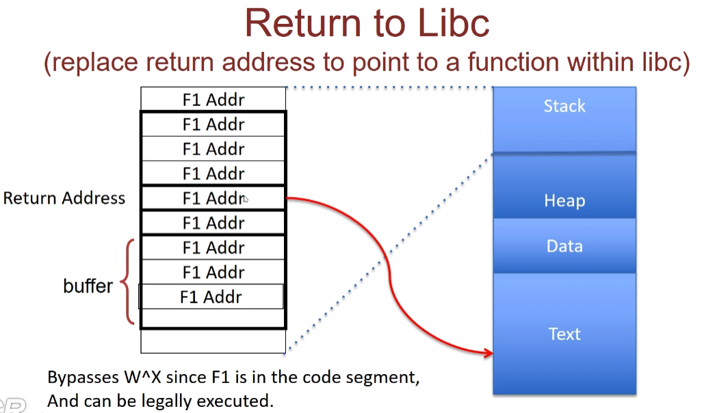
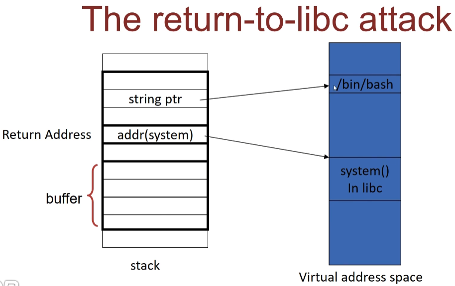

We dont execute any code on stack so the attack will run even if NX bit is enabled

Libc is dynamically linked library that gets attached to almost every C program
Libc contains standard C functions that we usually use : like scanf printf fopen



In this attack, we use buffer overflow to overwrite the return address to point to a function in Libc
Now what should be this function in libc that we want to go to by changing the return address
One option that can help us get a shell is `system()` function
`system()` function takes a pointer to string as a parameter
We can do like this `system("/bin/bash")` : would create a bash shell
We need address for `system()` and pointer to string `/bin/bash`



Argument for functions are taken from the stack
To find address of system, run a program, add a breakpoint before running it,when breakpoint hit, do

```shell
p system
```

OR


To find pointer to `/bin/bash`

```sh
strings -t x -a /lib/i386-linux-gnu/libc.so.6 | grep "/bin"
```


