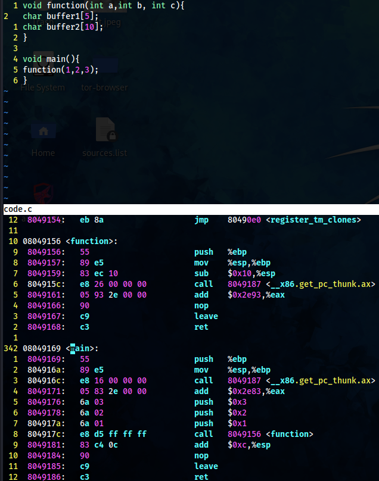
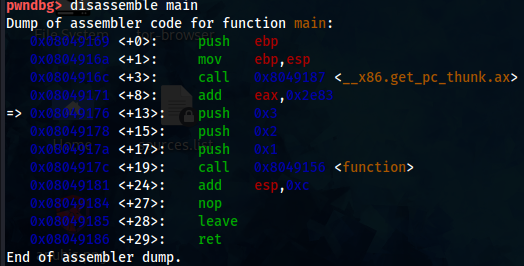

### Demonstration of Binaries in GDB

To compile the binary

```sh
gcc -fno-stack-protector -z execstack -no-pie -m32 -g code.c -o code
```

-fno-stack-protector : no stack canary
-z execstack : NX disabled so Stack is executable
-no-pie : Position Indepented Executable disabled so we can see the address rather than the offsets
-m32 : compile it as a 32 bit binary
-g : debugging symbols get added to executable

To read header

```sh
readelf -h ./code
```


```sh
objdump --disassemble-all ./code > code.lst
```



We can see that the parameter to the function named function() are first pushed onto the stack before calling it, those parameters are 0x3,0x2,0x1

push ebp
mov esp,ebp is function preamble to set the stack frame

After preamble we see that space for local variable is created that is
sub $0x10,%esp

0x10 = 16 bytes,
we have set buffer for a total of 15 bytes, buffer1 = 5 bytes and buffer2=10 bytes so total 15 but we see space allocated of 16 bytes so that the stack remains aligned

To list entire source code in gdb

```sh
list
```

To set a breakpoint at line number 7 of code

```sh
b 7
```

or we can just provide the address for the instruction

```sh
b *0x8049176
```

Run the program in gdb by typing `r`
When it hits breakpoint in gdb, we can look at the registers using

```sh
info registers eip esp ebp
```


We can see from EIP as well as the disassembly that the eip is pointing at 0x8049176 and in the disassembly that address corresponts to
push 0x3 meaning pushing parameters on stack for the next function which we are calling in this case that function is function()

To display/examine contents of esp

```sh
x/32x $esp
```

32 means number of memory locations that need to be displayed are 32
and second `x` that is 32x, this one specifies results should be displayed in hexadecimal

We can also see that the values of esp and ebp are the same because right now we are at the breakpoint where push instruction hasnt been executed yet and the instruction that was last executed was the function prologue
mov esp,ebp
so esp and ebp values are same right now

To disassemble in gdb

```sh
disassemble <functionName>
```



We can execute single instruction at a time in gdb using the commadn `si`

Right now we are on breakpoint so the push instruction will get executed
If we do `disassemble` now we will see that arrow is now pointing at
push 0x2

We can also check the contents of stack again

```sh
x/32x $esp
```


So now the instruction pointer must be pointing at `call function`

so right now we are trying to call a function so the first thing that happens is that address of `call function` is put in `eip` and the address of next instruction that is after `call function` is pushed onto the stack as return address


We can observe the stack now and see that the return address has been pushed onto the stack and we can see from the disassembly that what the return address was supposed to be pushed and the address in stack and the address in disassembly match

From our knowledge next the ebp must be pushed onto the stack


We can see that in `eip` the current address is of the first instruction in the function named function() and the first instruction is part of prologue of the function

to ececute 3 instructions

```sh
si 3
```

The instructions that were executed were

`push ebp`
`mov esp,ebp`
`sub 0x10,esp`

First 2 are the function prologue then `sub 0x10,esp` is the set 16 bytes for the buffer so the difference between the address of `esp` and `ebp` should be 10 bytes if we were check it


And we can see that address of `esp` is `0xffffce64` and address of `ebp` is `0xffffce74` and we know that stack grows from higher to lower address so `esp` is 10 bytes below `ebp`

The difference between `esp` and `ebp` is the active stack frame

If we want to look at the local variables of a function we can do that in gdb using

```sh
info locals
```

to print address for buffer1

```sh
p/x &buffer1
```

p : to print
x : to print in hexadecimal format

And we can see that buffer1 and buffer2 are both within the stack frame


Now we are only left with `leave` and `ret` instruction
The leave instruction restores the stack frame to the calling function in this case the main() function
and return would return back to main function

Now if we run disassemble we can see that execution has returned back to main() function
We can look are various registers to verify it


We can also look at the stack and see that the return address has been popped from the stack


